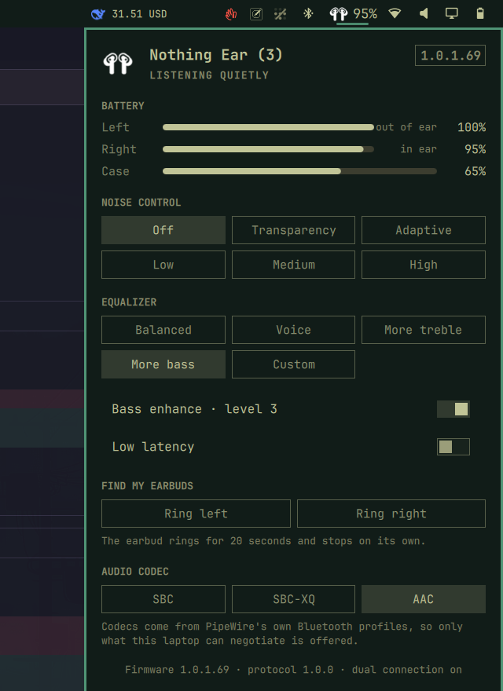

# Nothing Ear for Omarchy

An Omarchy bar widget for Nothing earbuds: the earbud artwork with the battery
percentage on the bar, and a panel with per-earbud and case battery, noise
control, equalizer presets, bass enhance, low latency, find-my-earbuds, and the
host audio codec. It is an unofficial desktop port of the everyday surface of
the Nothing X / Smart Center phone app.



The widget talks to the earbuds over their own Bluetooth control channel (the
Nothing X binary protocol on RFCOMM channel 15) through a short-lived Python
helper, so there is no daemon and no dependency beyond `python3`, `bluetoothctl`
and `pactl`.

## Features

- Bar icon: the earbud artwork with the weakest bud's percentage beside it,
  turning urgent below 20%, and the full breakdown in the tooltip
- Left, right and case battery, with a charging pulse and `in ear` / `out of
  ear` state per bud
- Noise control: Off, Transparency, Adaptive, Low, Medium, High
- Equalizer: Balanced, Voice, More treble, More bass, Custom
- Bass enhance toggle at the level the earbuds already have
- Low latency mode
- Find my earbuds: ring either bud, stopping itself after 20 seconds
- Audio codec, limited to what this laptop can actually negotiate over PipeWire
- Firmware, protocol version and dual-connection state in the panel footer
- Falls back to the single Bluetooth percentage if the control channel is busy

The case only reports while it is open. Once it closes, the last reading stays
on screen, dimmed, for 6 hours.

## Install

```bash
omarchy-shell shell rescanPlugins
omarchy plugin enable frank.nothingear
omarchy bar move frank.nothingear --section right    # or use the bar's own drag
```

Pair the earbuds through the normal Bluetooth panel first. The helper picks the
first connected device whose name contains `Nothing`, `Ear` or `CMF`.

## Settings

| Key | Default | What it does |
| --- | --- | --- |
| `hideWhenDisconnected` | `true` | Hide the icon while the earbuds are away. An error keeps it visible. |
| `deviceAddress` | `""` | Pin a Bluetooth address, for when several matching devices are paired. |
| `helperPath` | `""` | Use a different `nothing-earctl.py`. Empty uses the bundled one. |
| `refreshSeconds` | `60` | How often the bar icon re-reads the earbuds while connected. |

## Controls

Left click opens the panel, right click cycles noise control.

| Key | Action |
| --- | --- |
| `j` `k` `↓` `↑` | Move between groups |
| `h` `l` `←` `→` | Move between options |
| `Enter` `Space` | Activate |
| `o` `t` `a` | Off, Transparency, Adaptive |
| `Shift+L` `Shift+M` `Shift+H` | Low, Medium, High noise cancelling |
| `n` | Cycle noise control |
| `e` | Cycle equalizer preset |
| `b` | Toggle bass enhance |
| `g` | Toggle low latency |
| `p` `Shift+P` | Ring the left / right earbud (`x` is the shell's own delete key) |
| `c` | Cycle codec |
| `r` | Refresh |
| `Esc` | Close |

Plain `h` and `l` walk the chips, so the noise-control levels take the shifted
letters. The panel is also scriptable:

```bash
omarchy-shell nothing-ear toggle
omarchy-shell nothing-ear refresh
omarchy-shell nothing-ear noise        # prints the new mode
omarchy-shell nothing-ear eq
omarchy-shell nothing-ear find left
omarchy-shell nothing-ear status
```

## Helper

`nothing-earctl.py` is the only part that touches the hardware, and each call
opens the control channel, does one exchange, and closes it:

```bash
./nothing-earctl.py status
./nothing-earctl.py set-anc high
./nothing-earctl.py set-eq bass
./nothing-earctl.py set-bass on
./nothing-earctl.py set-latency on
./nothing-earctl.py set-find right on
./nothing-earctl.py diagnose          # raw payloads, for firmware changes
```

`status` always prints a full snapshot and exits 0; the `connected` and
`protocol` fields say which state the earbuds are in, and `error` carries only
what genuinely went wrong. Every other command prints `{"ok":...}`.

## Artwork

`assets/buds.png` is the bar artwork: the user's own picture, kept
white-on-transparent (generated from `assets/buds-source.png` with
`magick buds-source.png -colorspace gray -alpha copy -channel RGB -evaluate set
100% +channel -trim +repage -border 3 -resize 64x64 buds.png`) so it sits on any
bar background. Swap either file to change the icon; the theme colour is not
applied, so a light bar wants a dark source image.

## Notes and caveats

- Writes are optimistic: the panel shows the new value immediately and reverts
  it if the firmware does not confirm within five seconds.
- Firmware updates, gesture remapping and the advanced 8-band EQ editor are not
  ported. The control channel speaks them (see `diagnose`), but the phone app's
  own UI for them is out of scope here.
- Preset numbering (0 Balanced, 1 Voice, 2 More treble, 3 More bass, 5 Custom)
  is verified by write-and-read-back on Nothing Ear (3), firmware 1.0.1.69.
- Verified on Nothing Ear (3). The protocol is shared across the Ear family, so
  other Nothing earbuds should work; `diagnose` is there when one does not.

## Credits

The Nothing X protocol was not documented by Nothing; this port stands on the
reverse-engineering work of the community, in particular
[r-witz/omarchy-nothing-ear](https://github.com/r-witz/omarchy-nothing-ear)
(MIT, the framing and the case-cache idea) and
[Dospacite/NothingLinux](https://github.com/Dospacite/NothingLinux) (the
command table and payload layouts).

Nothing, Nothing Ear and Nothing X are trademarks of Nothing Technology
Limited. This project is unofficial and unaffiliated.
